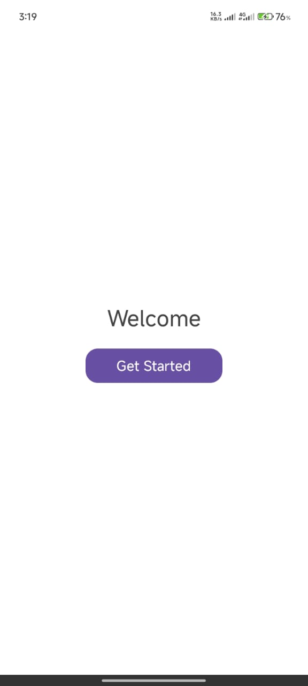
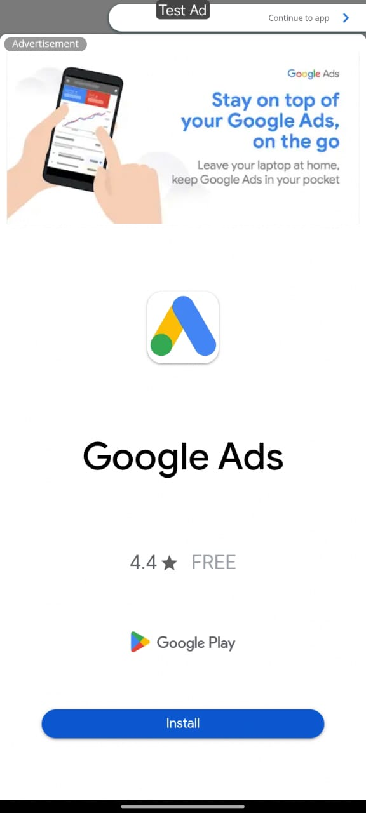
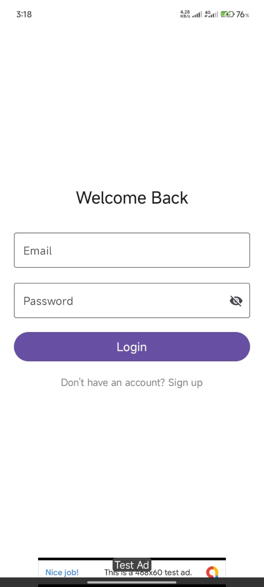
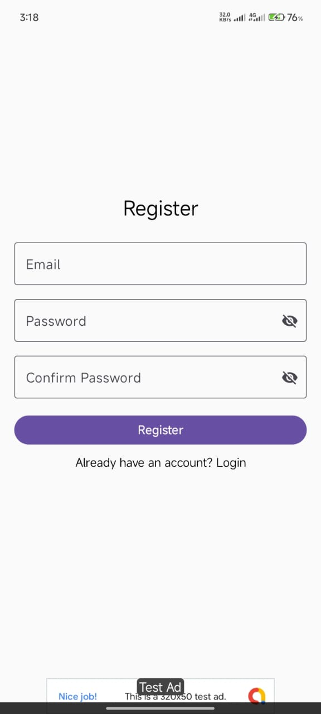
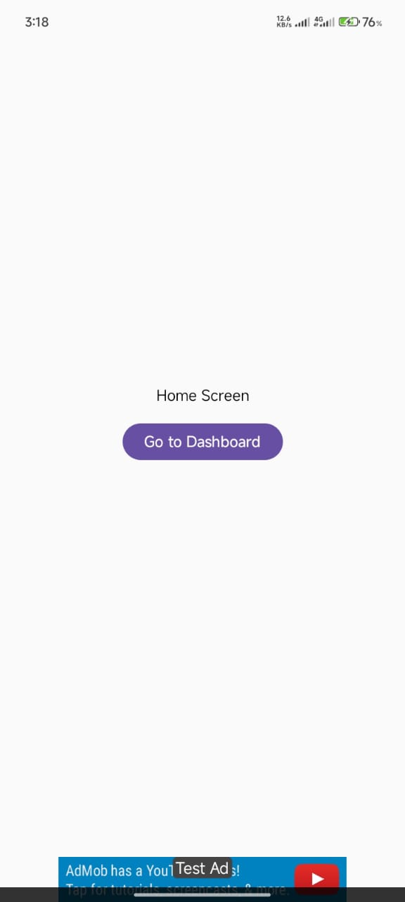
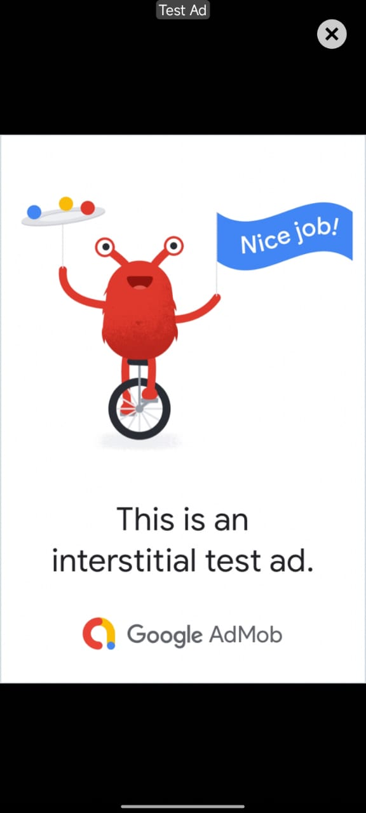
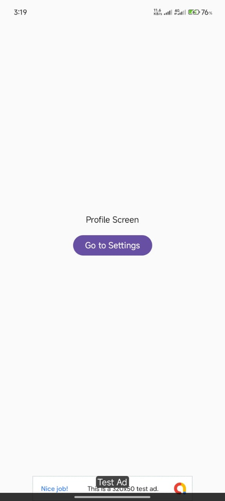

# 📱 AdMobFireBase-App
Android app with Open, Banner, and Interstitial Ads using AdMob and Firebase Realtime Database.
Includes Firebase Authentication for login/register and follows Google ad policies with smooth, crash-free ads. 

---

## 🚀 Features
- 📱 **5+ Screens** (excluding splash)
- 💰 **AdMob Monetization**:
  - 🏁 **Open Ads** – shown after splash screen
  - 📐 **Banner Ads** – at the bottom of every screen
  - 🎯 **Interstitial Ads** – shown after 3rd screen
- ☁ **Firebase Realtime Database** for ad unit IDs
- 🔐 Firebase Authentication:
  - Sign up with email & password
  - Log in with email & password
  - Basic form validation & error handling
- 🎨 Clean **UI/UX** with smooth ad loading
- 🛡 Test AdMob IDs for safe development
- 🚫 Crash-free error management
---

## 🛠 Installation & Setup

1. **Clone the Repository**
2. **Open in Android Studio**

   * Go to `File → Open` and select the project folder.

3. **Setup Firebase**

   * Visit [Firebase Console](https://console.firebase.google.com/)
   * Create a project and register your Android app
   * Download `google-services.json` and place it in:

     ```
     app/src/main/
     ```

4. **Enable AdMob Test Ads**

   * Using Google Test IDs:

     * **Banner Ad**
     * **Interstitial Ad**
     * **App Open Ad** → 

5. **Build & Run**

   * Connect a device or start an emulator
   * Press ▶ **Run** in Android Studio

---
## 📸 Screenshots

| Splash                 | OpenAd                 | Login              |
| ---------------------- | ---------------------- | ---------------------- |
|  |  |  |

| Register               | Home                   | Dashboard              |
| ---------------------- | ---------------------- | ---------------------- |
|  |  |  |

| Interstitial Ad        |Profile                 | Setting                |
| ---------------------- | ---------------------- | ---------------------- |
|  |  |  |

---

## 📋 Google Play Policy Notes

* ✅ All ads comply with [AdMob Policy](https://support.google.com/admob/answer/6128543)
* 🛠 Test IDs used for development

---


